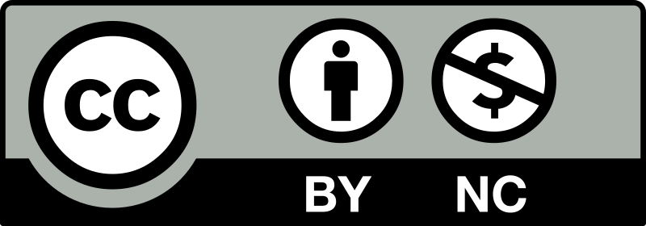

All my course material is freely available for use, adaptation, and distribution with attribution for non-commercial purposes under the Creative Commons CC BY-NC license. 

[Cartographic Convention Guide](https://docs.google.com/document/d/18-2nnxdJ1ISuHcluI0B5mvh2tnNuoV6E--zMdg_Gqdc/edit?usp=sharing)

[Spatial Data Exercise](https://docs.google.com/document/d/1FSQ_qW2N-UZt_c720G80TZH0uXBg0U63/edit?usp=sharing&ouid=101338019870957132383&rtpof=true&sd=true)

[Process Descriptions](https://docs.google.com/document/d/1o84N1MwLo5j0tP3yUH0KW8n8UWwWdalJMqSI1zyyoj8/edit?usp=sharing)

[Processing Quickstart Guide](https://docs.google.com/document/d/1e61QG_vqybpFGV94AhbItktJN4ToppYGMITKo7UDWXk/edit?usp=sharing)

[Practice Join](https://drive.google.com/drive/folders/1fuh0SP1bfQc22M8ZKSNRFMcdA4St-C8F?usp=sharing)

[Foundations of GIS Topics](https://docs.google.com/document/d/117RYCZIFXILcWkUGu9oqivkwGKa6bXMcm-XNmRleEyA/edit?usp=sharing)

[Foundations of GIS MC Quiz](https://docs.google.com/document/d/1sQ8zsAiAG9OtOrxZrl8xMCbkaRHyUPwyvMgkuFhsYQ8/edit?usp=sharing)

[Reprojecting Layers in QGIS](https://drive.google.com/file/d/1B08NJsHOk3ym3QWRDKSmx2tq1ggPW1Ep/view?usp=sharing)

[Making Connections](https://docs.google.com/document/d/103KxXsYEibByOTSYkn3FgpTGlRzhctUUdTz9SZQ26BI/edit?usp=sharing)

[PPA and R Demo](https://docs.google.com/document/d/1a7YA2BFCDEXrwZTChuIhUH9agkrlDQz--XDJp3qdF9U/edit?usp=sharing)
